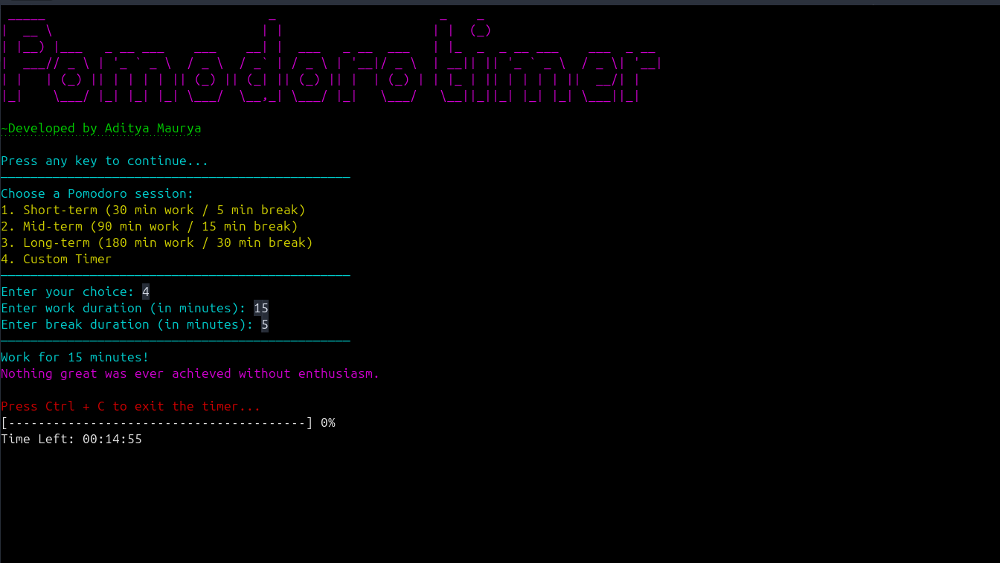

# Pomodoro Timer

A terminal-based Pomodoro Timer that helps you stay focused and productive. This timer features multiple session options, progress updates, break suggestions, and a daily focus report.

## Features

- **Multiple Work Sessions:**
  - Short-term (30 min work / 5 min break)
  - Mid-term (90 min work / 15 min break)
  - Long-term (180 min work / 30 min break)
  - Custom duration
- **Real-time Progress Display:** Shows countdown and percentage completed.
- **Break Suggestions:** Provides random productivity-boosting tips.
- **Session History:** Saves completed sessions in `pomodoro_history.txt`.
- **Motivational Quotes:** Displays a random motivational quote from `quotes.txt`.
- **Notifications & Sounds:** Alerts for session start and breaks (Linux only).
- **Colored Terminal Output:** Enhances readability using ANSI escape codes.

## Installation

### Prerequisites
- Linux or macOS (recommended)
- C++17 or later

### Clone the Repository
```sh
git clone https://github.com/yourusername/pomodoro-timer.git
cd pomodoro-timer
```

### Compile the Program
```sh
g++ -o pomodoro main.cpp -std=c++17 -pthread
```

## Usage

Run the compiled program:
```sh
./pomodoro
```

Follow the on-screen prompts to select a Pomodoro session.

## Filesystem Usage
- `quotes.txt`: Stores motivational quotes.
- `pomodoro_history.txt`: Logs completed sessions.

## Example Output
```
----------------------------------------
Work for 30 minutes!
----------------------------------------
[########------------] 50%
Time Left: 00:15:00
----------------------------------------
Break for 5 minutes!
----------------------------------------
Break Suggestion: Take a short walk to refresh your mind.
```

## Contributing

Contributions are welcome! 🎉  
If you'd like to improve this project, feel free to fork the repository, make changes, and submit a pull request. You can also open issues for feature requests or bug reports.

## License
This project is licensed under the MIT License.

## Author
- Developed by Aditya Maurya
- GitHub: [Aditya3435](https://github.com/Aditya3435)

---

🚀 **Stay focused and productive!** If you enjoy using this tool, consider giving it a ⭐ on GitHub!
